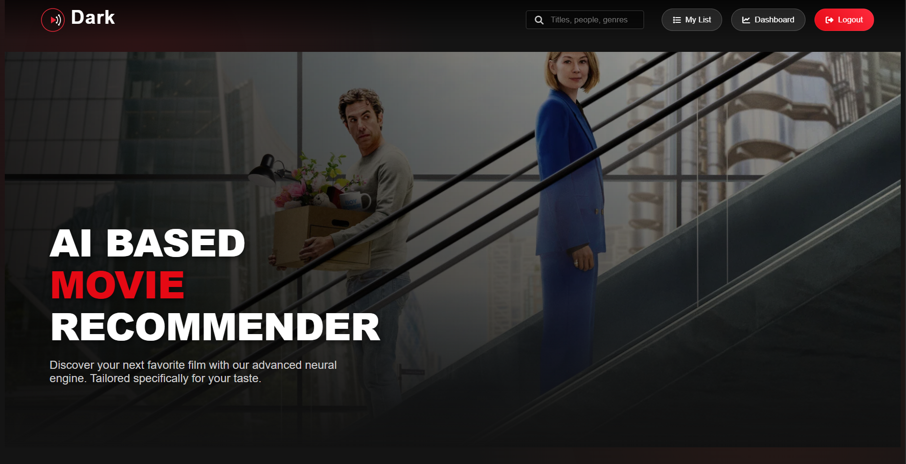
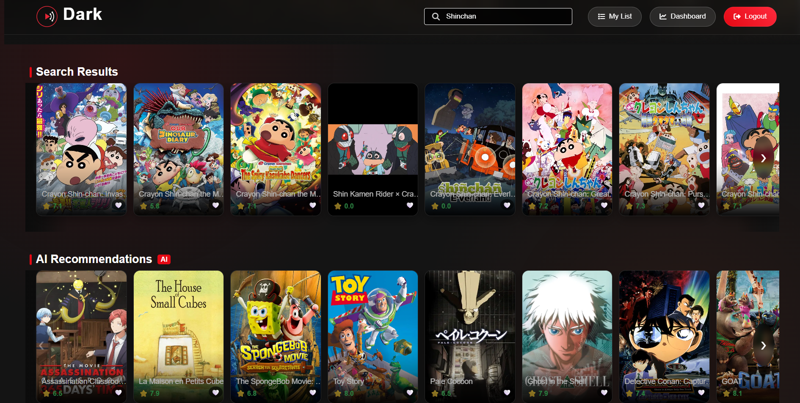
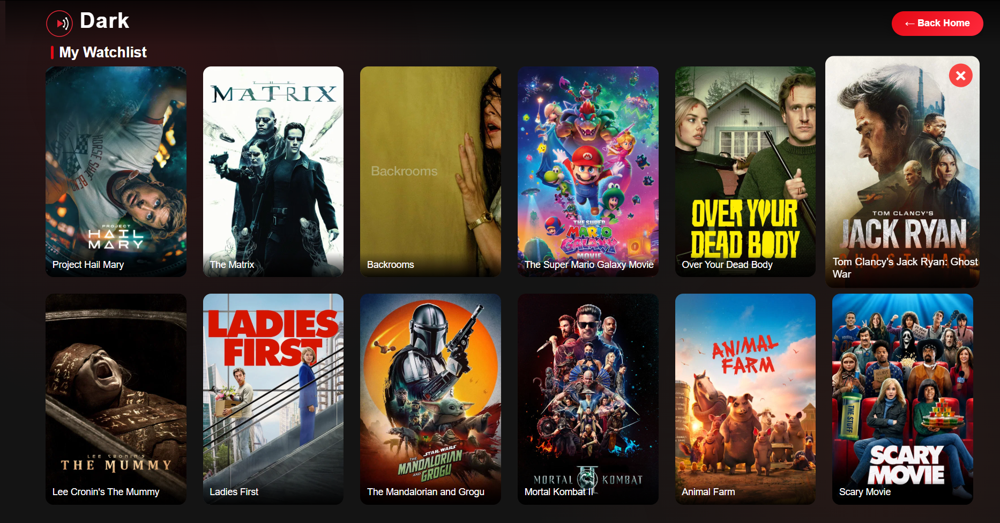
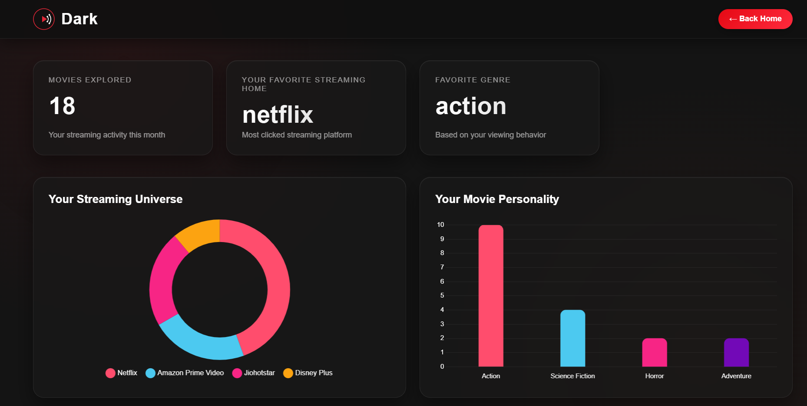

# 🎬 Dark AI Movie Recommendation Platform

A full-stack movie recommendation platform that combines intelligent movie discovery, personalized recommendations, watchlist management, streaming platform integration, and user analytics into a modern Netflix-inspired experience.

---

# 📌 Overview

Dark AI Movie Recommendation Platform is a full-stack web application built using HTML, CSS, JavaScript, Node.js, Express.js, and MongoDB.

The platform integrates with The Movie Database (TMDB) API to provide real-time movie information while offering personalized recommendations, secure authentication, analytics dashboards, and watchlist functionality.

---

# ✨ Key Features

## 🔐 Authentication & Security

- User Registration
- User Login
- JWT Authentication
- Protected Routes
- Password Hashing with bcrypt
- Rate Limiting
- Helmet Security Headers
- MongoDB Injection Protection

---

## 🎥 Movie Discovery

- Trending Movies
- Popular Movies
- Top Rated Movies
- Science Fiction Collection
- Horror Collection
- Movie Details
- Cast Information
- Movie Trailers
- OTT Provider Availability

---

## 🤖 Recommendation Engine

### Search-Based Recommendations

- Similar Movies
- Genre-Based Recommendations
- Duplicate Filtering
- Quality Ranking

### Personalized Recommendations

- Watchlist-Based Suggestions
- User Preference Analysis
- Favorite Genre Detection
- Streaming Platform Preferences

---

## ❤️ Watchlist Management

- Add Movies to Watchlist
- Remove Movies from Watchlist
- Persistent MongoDB Storage
- Personalized Recommendation Support

---

## 📺 OTT Streaming Integration

Supports major streaming platforms:

- Netflix
- Prime Video
- Disney+ Hotstar
- SonyLIV
- Zee5
- Apple TV
- Crunchyroll

---

## 📊 Analytics Dashboard

### User Insights

- Total Movies Explored
- Favorite OTT Platform
- Favorite Genre

### Visual Analytics

- Provider Distribution Charts
- Genre Preference Charts
- User Behavior Analysis

Powered by Chart.js.

---

# 🛠️ Technology Stack

## Frontend

- HTML5
- CSS3
- JavaScript (ES6)
- Chart.js

## Backend

- Node.js
- Express.js

## Database

- MongoDB Atlas
- Mongoose

## Authentication

- JWT
- bcrypt.js

## APIs

- TMDB API

## Security

- Helmet
- Express Rate Limit
- Express Mongo Sanitize

---

# 🏗️ System Architecture

```text
                    User
                      │
                      ▼
             Frontend Application
          (HTML, CSS, JavaScript)
                      │
                      ▼
                Express API
                      │
     ┌────────────────┼────────────────┐
     │                │                │
     ▼                ▼                ▼
Authentication  Recommendation   Analytics
    Engine         Engine         Engine
                      │
                      ▼
                 MongoDB Atlas
                      │
                      ▼
                   TMDB API
```

---

# 📂 Project Structure

```text
movie-ai-fullstack/
│
├── README.md
│
├── backend/
│   ├── config/
│   ├── middleware/
│   ├── models/
│   ├── routes/
│   ├── server.js
│   └── README.md
│
├── frontend/
│   ├── assets/
│   ├── index.html
│   ├── login.html
│   ├── dashboard.html
│   ├── watchlist.html
│   ├── script.js
│   ├── modal.js
│   ├── dashboard.js
│   ├── watchlist.js
│   ├── style.css
│   └── README.md
│
└── screenshots/
```

---
## Frontend Setup

Open:

```text
frontend/index.html
```

using Live Server or any local web server.

---

# 📸 Screenshots

Add screenshots here after deployment.

### Home Page



### Movie Details 



### Watchlist



### Analytics Dashboard



---

# 🔮 Future Enhancements

- AI Recommendation Models
- User Reviews & Ratings
- Advanced Analytics
- Redis Caching
- Docker Support
- CI/CD Pipeline
- Cloud Deployment
- Social Features

---

# 👨‍💻 Developer

Developed as a full-stack project demonstrating:

- Full Stack Web Development
- REST API Design
- MongoDB Integration
- JWT Authentication
- Recommendation Systems
- Analytics Dashboard Development
- Security Best Practices
- External API Integration

---

# 📄 License

This project is licensed under the MIT License.

---

# 🙏 Acknowledgements

- TMDB (The Movie Database)
- Chart.js
- MongoDB Atlas
- Express.js
- Node.js

---

⚠️ This product uses the TMDB API but is not endorsed or certified by TMDB.
