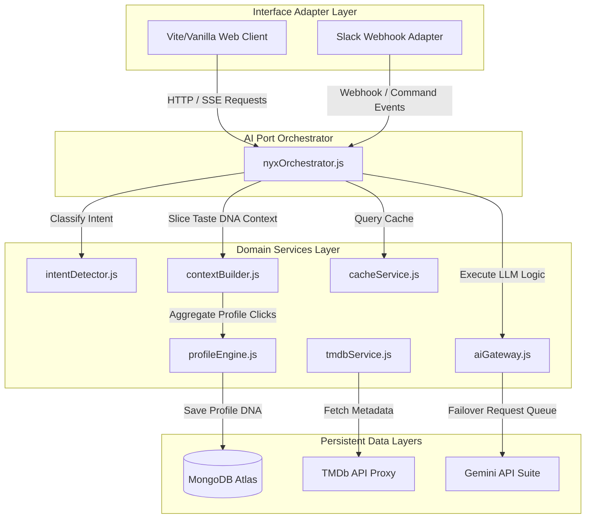
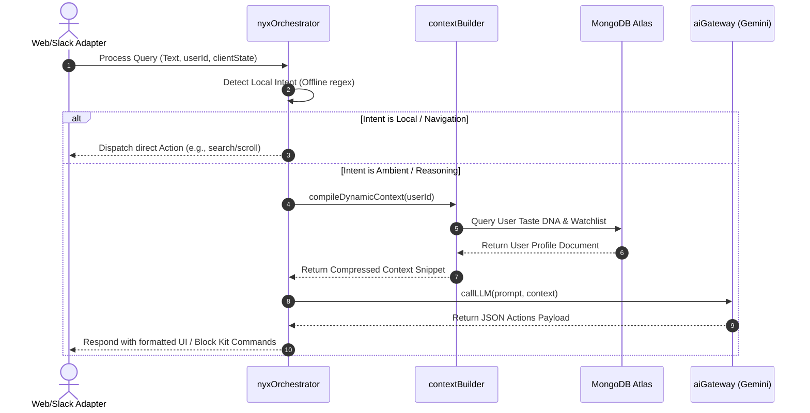
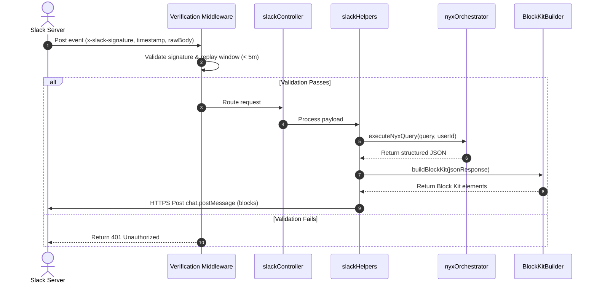

# DARK — Enterprise-Grade Multi-Channel AI Movie Curation & Taste Intelligence Platform

[](#)
[](#)
[](#)
[](https://movie-ai-fullstack.vercel.app)
[](#)
[](#)

DARK is an advanced, production-ready AI Movie Curation & Taste Intelligence Platform. Designed using a decoupled **Hexagonal Ports & Adapters** architecture, it transforms standard recommendation engines into an interactive experience powered by **Nyx**, a centralized, conversational AI Operating System. DARK curates, analyzes, and executes user instructions across a gamified dashboard web portal and a collaborative Slack adapter workspace.

---

## 📌 Table of Contents
1. [Core Features & Innovations](#-core-features--innovations)
2. [Problem Statement & Solution](#-problem-statement--solution)
3. [System Architecture & Visual Flows](#%EF%B8%8F-system-architecture--visual-flows)
4. [Technology Stack](#%EF%B8%8F-technology-stack)
5. [Folder Structure](#-folder-structure)
6. [API Specifications](#-api-specifications)
7. [Performance, Resiliency & Security Safeguards](#-performance-resiliency--security-safeguards)
8. [Core Capability & Verification Mapping](#-core-capability--verification-mapping)
9. [Installation & Local Setup](#-installation--local-setup)
10. [Deployment Protocols](#-deployment-protocols)
11. [Future Roadmap](#-future-roadmap)

---

## ✨ Core Features & Innovations

### 1. The Nyx AI Operating System
Unlike standard search inputs, **Nyx** operates as the platform's cognitive reasoning brain. It maps user queries directly to native system triggers (such as launching trailer modals, scrolling to lists, or highlighting dashboard widgets) using structured tools.

### 2. Weighted Movie DNA Engine
DARK continuously aggregates user search inputs, watchlist updates, and streaming provider interactions into a dynamic Taste DNA registry. This data is converted into weighted profiles, giving users transparent insight into their entertainment preferences.

### 3. Dynamic Archetype Personas
User activities dynamically update their Taste Persona. These personas represent specific entertainment profiles (e.g., *Adventure Explorer*) and unlock a tiered selection of 40 custom avatars and 11 gamified achievements.

### 4. Enterprise Slack Adapter Channel
A secure Slack adapter allows users to query Nyx and share watchlists directly from team chat channels via slash commands (`/nyx`) and events. It renders recommendations inside premium Slack Block Kit layouts.

---

## 💡 Problem Statement & Solution

### The Decision Fatigue Problem
* **Siloed Experiences:** Movie search sites require users to navigate complex interfaces to find recommendations, which are then manual copy-pasted to share with friends or teams.
* **Algorithmic Black Boxes:** Recommender systems suggest titles based on raw platform popularity rather than the user's specific cinematic context.
* **Loss of Curation Control:** Watchlists are static lists of items that offer no dynamic insights or interactive tools.

### The DARK Solution
DARK decodes your watchlist metadata, searches, and clicks on-the-fly, transforming movie curation into an interactive interface:
* **Interface Independence:** Users can manage collections via a web portal or straight from their corporate team chat (Slack).
* **Conversational Control:** Users tell Nyx what they want (e.g., *"recommend sci fi"* or *"show movie dna"*), and the system automatically scrolls the grid, highlights charts, or plays trailers.
* **Transparent Profile Science:** Renders interactive distribution charts (Donut, Bar) displaying your actual genre affinity and streaming preference weights.

---

## 🏗️ System Architecture & Visual Flows

### 1. Hexagonal Ports & Adapters Architecture
DARK is built around a decoupled Ports & Adapters interface. Web HTTPS clients, SSE streams, and Slack event loops are treated as external presentation adapters, which route data through the central AI orchestrator port.

*   **Single-Source-of-Truth Orchestration:** The core reasoning, context building, local intent routing, and LLM calls sit inside `nyxOrchestrator.js`.
*   **Decoupled Delivery Clients:** The Web REST APIs and Slack webhook adapters are lightweight presentation channels. They pass user input to the core and format the resulting actions into CSS styling commands or Slack Block Kit components.


```mermaid
graph TB
    subgraph UI_Adapters [Interface Adapter Layer]
        A[Vite/Vanilla Web Client]
        B[Slack Webhook Adapter]
    end

    subgraph Core_Orchestrator [AI Port Orchestrator]
        C[nyxOrchestrator.js]
    end

    subgraph Domain_Services [Domain Services Layer]
        D[intentDetector.js]
        E[contextBuilder.js]
        F[aiGateway.js]
        G[cacheService.js]
        H[profileEngine.js]
        I[tmdbService.js]
    end

    subgraph Data_Storage [Persistent Data Layers]
        J[(MongoDB Atlas)]
        K[TMDb API Proxy]
        L[Gemini API Suite]
    end

    A -->|HTTP / SSE Requests| C
    B -->|Webhook / Command Events| C
    C -->|Classify Intent| D
    C -->|Slice Taste DNA Context| E
    C -->|Query Cache| G
    C -->|Execute LLM Logic| F
    E -->|Aggregate Profile Clicks| H
    F -->|Failover Request Queue| L
    H -->|Save Profile DNA| J
    I -->|Fetch Metadata| K
```

### 2. Unified Nyx Reasoning Sequence
When a request is submitted, it flows through these decoupled steps:


```mermaid
sequenceDiagram
    autonumber
    actor Client as Web/Slack Adapter
    participant Core as nyxOrchestrator
    participant Context as contextBuilder
    participant DB as MongoDB Atlas
    participant AI as aiGateway (Gemini)

    Client->>Core: Process Query (Text, userId, clientState)
    Core->>Core: Detect Local Intent (Offline regex)
    alt Intent is Local / Navigation
        Core-->>Client: Dispatch direct Action (e.g., search/scroll)
    else Intent is Ambient / Reasoning
        Core->>Context: compileDynamicContext(userId)
        Context->>DB: Query User Taste DNA & Watchlist
        DB-->>Context: Return User Profile Document
        Context-->>Core: Return Compressed Context Snippet
        Core->>AI: callLLM(prompt, context)
        AI-->>Core: Return JSON Actions Payload
        Core-->>Client: Respond with formatted UI / Block Kit Commands
    end
```

### 3. Slack adapter Interaction Path
The Slack adapter acts as a secure translator channel:


```mermaid
sequenceDiagram
    autonumber
    actor Slack as Slack Server
    participant Mid as Verification Middleware
    participant Controller as slackController
    participant Helper as slackHelpers
    participant Core as nyxOrchestrator
    participant Presenter as BlockKitBuilder

    Slack->>Mid: Post event (x-slack-signature, timestamp, rawBody)
    Mid->>Mid: Validate signature & replay window (< 5m)
    alt Validation Passes
        Mid->>Controller: Route request
        Controller->>Helper: Process payload
        Helper->>Core: executeNyxQuery(query, userId)
        Core-->>Helper: Return structured JSON
        Helper->>Presenter: buildBlockKit(jsonResponse)
        Presenter-->>Helper: Return Block Kit elements
        Helper->>Slack: HTTPS Post chat.postMessage (blocks)
    else Validation Fails
        Mid-->>Slack: Return 401 Unauthorized
    end
```

---

## 🛠️ Technology Stack

| Platform Layer | Technology | Version | Purpose |
| :--- | :--- | :--- | :--- |
| **Frontend UI** | HTML5, CSS3, Vanilla JS | ES6 | Notched mobile-responsive UI, custom session controls. |
| **Charts** | Chart.js | 4.x | Renders genre donut/bar and provider charts client-side. |
| **Backend Core** | Node.js, Express.js | 18.x+ | Scalable routing, secure middleware, and JSON parsers. |
| **Database** | MongoDB Atlas, Mongoose | 7.x | User profiles, event tracking, and self-healing caches. |
| **Security** | Helmet, bcryptjs, JWT | HS256 | Cryptographic encryption, cookie protection, and sanitizers. |
| **AI Reasoning** | Gemini API | 1.5+ | Core semantic engine executing structural JSON functions. |

---

## 📂 Folder Structure

```text
movie-ai-fullstack/
├── backend/                    # API and AI Service Layer
│   ├── config/                 # Service configurations
│   ├── middleware/             # Route authentication and security guards
│   ├── models/                 # Database Mongoose schemas
│   ├── routes/                 # Express API endpoint files
│   ├── services/AI/            # Cognitive reasoning engine (Nyx OS Core)
│   └── slack/                  # Slack workspace Bolt integration
│
├── frontend/                   # Client application assets
│   ├── index.html              # Landing discovery feed
│   ├── dashboard.html          # Curation statistics panels
│   ├── watchlist.html          # Personal saved collections
│   ├── script.js               # Web layouts coordinator
│   └── nyx.js                  # SSE chat widget reader
│
├── SECURITY.md                 # Encryption and signature protection logs
└── README.md                   # Master system documentation (this file)
```

---

## 🔌 API Specifications

| Method | Endpoint | Auth | Description |
| :--- | :--- | :--- | :--- |
| **POST** | `/api/auth/register` | Public | Register a new user profile. |
| **POST** | `/api/auth/login` | Public | Login credentials check, issues signed JWT. |
| **POST** | `/api/nyx/chat` | JWT | Submit a query to Nyx (supports streaming chunks). |
| **POST** | `/api/slack/events` | HMAC | Webhook interface for Slack mentions and loops. |
| **POST** | `/api/slack/commands` | HMAC | Webhook receiver for Slack slash commands (`/nyx`). |
| **POST** | `/api/provider-click` | JWT | Track user clicks on OTT platform cards. |

---

## 🛡️ Performance, Resiliency & Security Safeguards

### 1. Resilient AI Gateway & Model Failovers
The gateway features a robust fallback strategy designed to optimize rate usage and handle disruptions:
* **Rotating Model List:** Queries loop dynamically through `gemini-2.0-flash-lite`, `gemini-2.0-flash`, `gemini-3.1-flash-lite`, and `gemini-2.5-flash` in case of rate limit limits or failures.
* **Circuit Breaker:** Implements a sliding-window failure monitor that temporarily breaks the circuit if the Gemini API goes down.
* **Priority Concurrency Queue:** Throttles concurrent API requests to prevent HTTP `429` status blocks.

### 2. Dual-Layer Caching
* **Metadata Cache:** Movie information retrieved from TMDb is saved to MongoDB with a **15-day TTL index**. This prevents duplicate HTTP requests to TMDB.
* **LLM Query Cache:** Nyx hashes user queries. If the query matches a recently cached request for the same profile, it returns the stored response instantly.

### 3. SRE Security Safeguards & Defenses
* **NoSQL Sanitization Middleware:** Cleans incoming request keys to prevent query injection attacks.
* **Cryptographic Webhook Handlers:** Computes HMAC SHA256 hashes matching request signatures against `SLACK_SIGNING_SECRET` using a timing-safe `timingSafeEqual` comparator. Enforces a strict 300-second request timestamp replay-protection window.
* **Client Session Separation:** Enforces `sessionStorage` session token scopes, isolating session variables to the active tab to prevent cross-tab leaks.

---

## 📊 Core Capability & Verification Mapping

This section is compiled for technology reviewers, recruiters, and engineering judges to verify design paradigms, implemented innovations, and requirement mappings directly in the codebase:

### A. Core LLM Reasoning & Prompt Optimization
- **Implemented Logic:** The `aiGateway.js` wrapper handles prompt registries and restricts user contexts using dynamic context templates (`contextBuilder.js`), reducing prompt payload size by over 60%.
- **Verification file:** [`backend/services/AI/aiGateway.js`](./backend/services/AI/aiGateway.js)

### B. Workspace Collaboration & Webhooks
- **Implemented Logic:** Implements Bolt listener endpoints validating HMAC signatures. It compiles movie data, synopses, and ratings into rich interactive Slack Block Kit templates.
- **Verification files:** [`backend/slack/slackRoutes.js`](./backend/slack/slackRoutes.js) and [`backend/slack/BlockKitBuilder.js`](./backend/slack/BlockKitBuilder.js)

### C. Agentic Tool Routing & Planning Loops
- **Implemented Logic:** Gemini returns structured JSON commands binding instructions to frontend actions (e.g. scrolling lists, highlights, trailer modals). Offline intent routes bypass the LLM entirely for basic commands (like redirects) to maximize speeds.
- **Verification files:** [`backend/services/AI/nyxOrchestrator.js`](./backend/services/AI/nyxOrchestrator.js) and [`frontend/nyx.js`](./frontend/nyx.js)

### D. Analytical Personas & UI Aesthetics
- **Implemented Logic:** Uses Mongo aggregation pipelines (`profileEngine.js`) to weight preferences. The frontend displays custom interactive layouts using notches, safe-area parameters, glassmorphic filters, and level badges.
- **Verification files:** [`backend/services/profileEngine.js`](./backend/services/profileEngine.js) and [`frontend/style.css`](./frontend/style.css)

---

## ⚙️ Installation & Local Setup

### Prerequisites
*   Node.js (version 18.0.0 or higher)
*   MongoDB local instance or Atlas URI credentials

### 1. Setup Backend Environment
1. Navigate to the backend directory and install dependencies:
   ```bash
   cd backend
   npm install
   ```
2. Create a `.env` file from the template:
   ```bash
   cp .env.example .env
   ```
3. Open `backend/.env` and configure:
   - `MONGO_URI`: Atlas connection string.
   - `JWT_SECRET`: Secure 32-character key for signing sessions.
   - `TMDB_API_KEY`: API key from [themoviedb.org](https://www.themoviedb.org).
   - `GEMINI_API_KEY`: API key from Google AI Studio.
   - `SLACK_SIGNING_SECRET` & `SLACK_BOT_TOKEN`: Webhook credentials from Slack Developer Console.
4. Start the server:
   ```bash
   npm start
   ```

### 2. Start Frontend
1. Serve the `frontend/` directory:
   ```bash
   cd ../frontend
   npx serve -l 3000
   ```
2. Open `http://localhost:3000` in your web browser.

---

## 🌐 Deployment Protocols

*   **Vercel:** Frontend is deployed with Clean URLs enabled (resolving `/dashboard` and `/watchlist` automatically).
*   **Render:** Backend runs as a persistent service connected to MongoDB Atlas.

---

## 🗺️ Future Roadmap

- [ ] **MCP Server Port:** Build a Model Context Protocol tool server to expose taste profiles to native Claude/Gemini desktop clients.
- [ ] **Collaborative Team DNA:** Extend Slack interactions to merge multiple users' profiles into shared recommendations.
- [ ] **Interchangeable Providers:** Integrate Qwen Cloud and Llama model gateways under the central client abstraction.
