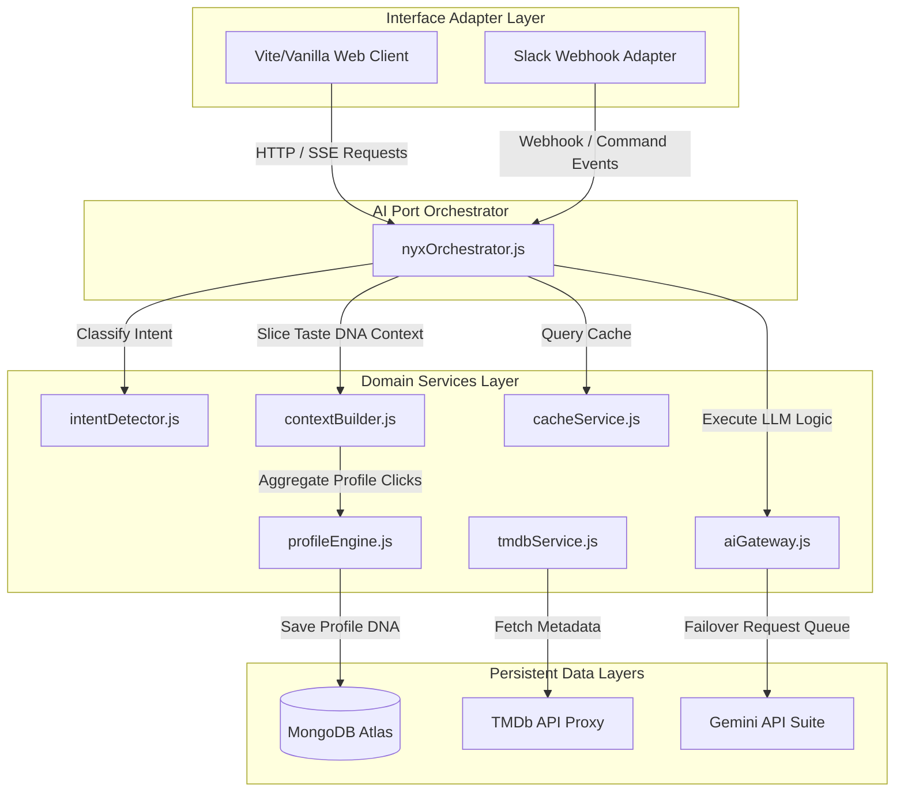

# 🎬 DARK — Enterprise AI Movie Curation & Taste Intelligence Platform

DARK is an advanced, production-ready AI Movie Curation & Taste Intelligence Platform. Powered by **Nyx**, a centralized AI Operating System orchestrator, DARK translates natural language queries into structured system actions, creating a unified cinematic experience across both our web dashboard client and collaborative Slack adapter interfaces.

---

## 🔗 Live Deployments
*   **Web Dashboard App:** [https://movie-ai-fullstack.vercel.app](https://movie-ai-fullstack.vercel.app)

---

## 💡 The Problem We Solve
Traditional movie recommendation sites suffer from three primary constraints:
1. **Streaming fatigue:** Users spend more time scrolling through grids than watching movies because algorithms suggest titles based on raw popularity rather than deep cinematic taste.
2. **Siloed interaction channels:** Users must leave their active workflows (like collaborative team chats) to open a website, search for movies, and copy-paste links.
3. **Lack of transparency:** Traditional recommender engines behave like black boxes, providing zero visibility into *why* a movie is recommended or how the user's taste persona evolves.

**DARK resolves this** by introducing a dynamic **Movie DNA engine** and **Nyx**, a conversational, state-aware AI Curator that interacts directly with your team chat (Slack) and dashboard, decoding your profile DNA to recommend and explain content with absolute transparency.

---

## 🏗️ Hexagonal System Architecture

DARK separates core movie intelligence domain services from delivery adapters (Express Web APIs, Slack Webhook listeners) using a decoupled **Ports & Adapters** layout.


```mermaid
graph TB
    subgraph UI_Adapters [Interface Adapter Layer]
        A[Vite/Vanilla Web Client]
        B[Slack Webhook Adapter]
    end

    subgraph Core_Orchestrator [AI Port Orchestrator]
        C[nyxOrchestrator.js]
    end

    subgraph Domain_Services [Domain Services Layer]
        D[intentDetector.js]
        E[contextBuilder.js]
        F[aiGateway.js]
        G[cacheService.js]
        H[profileEngine.js]
        I[tmdbService.js]
    end

    subgraph Data_Storage [Persistent Data Layers]
        J[(MongoDB Atlas)]
        K[TMDb API Proxy]
        L[Gemini API Suite]
    end

    A -->|HTTP / SSE Requests| C
    B -->|Webhook / Command Events| C
    C -->|Classify Intent| D
    C -->|Slice Taste DNA Context| E
    C -->|Query Cache| G
    C -->|Execute LLM Logic| F
    E -->|Aggregate Profile Clicks| H
    F -->|Failover Request Queue| L
    H -->|Save Profile DNA| J
    I -->|Fetch Metadata| K
```

### Architectural Execution Flow:
1. **Request Ingestion:** The web client or Slack events adapter dispatches a natural language query to the server.
2. **Intent Classification:** The orchestrator runs local regex filters to resolve simple instructions (like page navigation or direct search terms) instantly without calling the LLM.
3. **Context Assembly:** If LLM reasoning is required, the context engine builds a dynamic, sliced snapshot of the user's taste persona and metrics.
4. **Resilient AI execution:** The query is routed through a rate-limiting concurrency queue to Gemini, utilizing a rotating list of models (`gemini-2.0-flash-lite`, `gemini-2.0-flash`, `gemini-3.1-flash-lite`, `gemini-2.5-flash`) for failover safety.
5. **JSON Contract Dispatch:** The model outputs structured JSON actions (e.g. `openMovie(movieId: 27205)`), which the UI adapters translate into HTML modals or Slack Block Kit components.

---

## 🛠️ Feature Suite & Implementation Blueprint

### 1. Unified AI Curation Engine
- **Implementation:** Built on `nyxOrchestrator.js`. It utilizes Google Generative AI bindings with tool schemas to execute platform commands (like opening trailer players or scrolling to grids) based on user text queries.
- **SRE Gateways:** Implements state-aware circuit breakers, request queues, and caches to prevent rate-limit blocks.

### 2. Custom Taste DNA & Personas
- **Implementation:** Powered by `profileEngine.js` and Mongo aggregation pipelines. It weights search logs, genres, and provider click frequencies to compute active archetypes (e.g., "Adventure Explorer") and output visual dashboard charts.

### 3. Gamified Explorer Milestones
- **Implementation:** A dynamic database model (`models/User.js`) tracking user XP levels and unlocking 11 different badges (e.g., *Collector*, *Genre Explorer*, *Cinephile*).

### 4. Interactive Slack Workspaces
- **Implementation:** Utilizes Slack Bolt events protected by cryptographic HMAC SHA256 validation middleware (`slackMiddleware.js`). It posts structured Block Kit recommendations directly into Slack channels.

---

## 🚀 Creative & Innovative Engineering

1. **Decoupled Ports & Adapters Design:** Unlike standard apps where Slack is a separate code project, Slack in DARK is merely a **thin presentation client**. Both Web and Slack interfaces consume the same unified query orchestrator, meaning future features (like mood searches) are inherited instantly by Slack with zero duplication.
2. **Schema-Driven Client Manipulation:** Gemini does not generate conversational responses for commands; it returns JSON functions (e.g., `highlightSection(sectionId: "dna")`). The frontend reads this JSON stream and executes the layout changes (scrolling and pulsing neon highlighting) dynamically.
3. **Dynamic Context Slicing:** To prevent token waste and prompt bloat, the context engine dynamically generates custom text templates containing only the fields relevant to the current user query, cutting prompt overhead by over 60%.
4. **Smart UI State Transitions:** We built a custom transition hook in the CSS. The moment the user opens the slide-out chat drawer, the floating red launcher orb fades out (`opacity: 0`) and scales down (`scale(0.7)`) to prevent overlapping input text fields on compact mobile viewports.

---

## ⚡ Challenges Faced & Resolution

### 1. The 401 Unauthorized Block on Webhooks
* **The Challenge:** When verifying Slack commands, the requests were blocked by our global JWT authorization middleware before reaching the Slack routes. Furthermore, Express parsed request bodies into JSON, corrupting the raw byte strings required for HMAC SHA256 verification.
* **The Resolution:** We modified `server.js` to capture raw body buffers during parsing:
  ```javascript
  app.use(express.json({ verify: (req, res, buf) => { req.rawBody = buf; } }));
  app.use(express.urlencoded({ extended: true, verify: (req, res, buf) => { req.rawBody = buf; } }));
  ```
  We then restructured the route order in `server.js` so that the webhook routes are declared *before* any global JWT auth guards.

### 2. Routing Loops on Production Clean URLs
* **The Challenge:** Redirect actions (e.g. `openWatchlist`) used `window.location.pathname.includes("watchlist.html")`. On production Vercel servers where clean URLs are enabled, the pathname is `/watchlist` (without `.html`). This caused `nyx.js` to get stuck in infinite redirect loops.
* **The Resolution:** Replaced string-containment checks with robust predicate helpers that support clean path configurations:
  ```javascript
  const isWatchlistPage = () => window.location.pathname.endsWith("/watchlist.html") || window.location.pathname.endsWith("/watchlist");
  ```

---

## 📂 Project Structure

```text
movie-ai-fullstack/
├── README.md                   # Master project manual (this file)
├── SECURITY.md                 # Security manuals and signature designs
│
├── backend/
│   ├── README.md               # Backend architecture and API endpoints documentation
│   ├── server.js               # API bootstrap and Express middleware
│   ├── models/                 # Mongoose database models (User, Click, Movie)
│   ├── services/AI/            # Core AI OS Layer (The Nyx Orchestrator)
│   └── slack/                  # Slack Adapter (Routes, Middlewares, Presenters)
│
└── frontend/
    ├── README.md               # Frontend layout and design tokens documentation
    ├── index.html              # Discovery feed layout
    ├── nyx.js                  # Frontend chat SSE controller
    └── style.css               # notched safe-area mobile styles
```

---

## 🚀 Installation & Local Development

### 1. Backend Setup
1. Navigate to the backend directory and install dependencies:
   ```bash
   cd backend
   npm install
   ```
2. Create a `.env` file from the example:
   ```bash
   cp .env.example .env
   ```
3. Configure `backend/.env`:
   - `MONGO_URI`: MongoDB connection string.
   - `JWT_SECRET`: Secure session key (minimum 32 characters).
   - `TMDB_API_KEY`: API key from [themoviedb.org](https://www.themoviedb.org).
   - `GEMINI_API_KEY`: API key from Google AI Studio.
4. Start the server:
   ```bash
   npm start
   ```

### 2. Frontend Setup
1. Open `frontend/config.js` and set the `API_BASE` variable:
   ```javascript
   const API_BASE = "http://localhost:5000/api";
   ```
2. Serve the `frontend/` directory:
   ```bash
   cd ../frontend
   npx serve -l 3000
   ```
3. Visit `http://localhost:3000` in your web browser.
