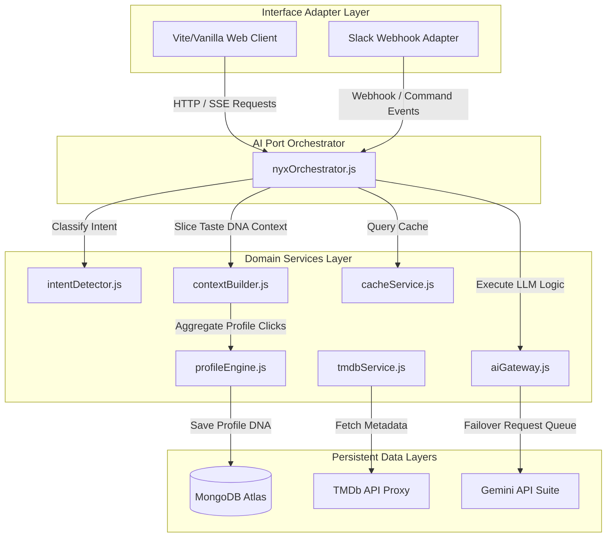

# 🎬 DARK — Enterprise AI Movie Curation & Taste Intelligence Platform

DARK is an advanced, production-ready AI Movie Intelligence Platform. Built with a decoupled **Hexagonal Ports & Adapters** architecture, it powers multiple interaction interfaces—a gamified glassmorphic web portal and a collaborative Slack workspace adapter—using a single source of truth AI reasoning orchestrator.

DARK is designed for submission to multiple international hackathons:
*   **Code with Gemini API Challenge:** Resilient AI Gateway, model failover, and local caching.
*   **Slack Agent Builder Challenge:** Interactive Block Kit layouts, verified webhooks, and workspace linking.
*   **Agentic AI Innovation Challenge:** Schema-driven tool execution and dynamic context slicing.
*   **Next Byte Hacks / Hack The Limit:** Hexagonal architecture, modular clean code, and database sanitization defenses.
*   **Aethera / LUMA Hacks:** Taste DNA personas, visual dashboard analytics, and premium dark aesthetics.

---

## 🔗 Live Deployments
*   **Web Dashboard App:** [https://movie-ai-fullstack.vercel.app](https://movie-ai-fullstack.vercel.app)
*   **Production API Server:** [https://movie-ai-backend-ql2a.onrender.com](https://movie-ai-backend-ql2a.onrender.com)
*   **Slack Integration Webhook:** `https://movie-ai-backend-ql2a.onrender.com/api/slack/events`

---

## 🏗️ Hexagonal System Architecture

DARK separates core movie intelligence domain services from integration delivery adapters (Express Web APIs, Slack Webhook listeners, future Discord/Mobile clients) to prevent logic duplication.


```mermaid
graph TB
    subgraph UI_Adapters [Interface Adapter Layer]
        A[Vite/Vanilla Web Client]
        B[Slack Webhook Adapter]
    end

    subgraph Core_Orchestrator [AI Port Orchestrator]
        C[nyxOrchestrator.js]
    end

    subgraph Domain_Services [Domain Services Layer]
        D[intentDetector.js]
        E[contextBuilder.js]
        F[aiGateway.js]
        G[cacheService.js]
        H[profileEngine.js]
        I[tmdbService.js]
    end

    subgraph Data_Storage [Persistent Data Layers]
        J[(MongoDB Atlas)]
        K[TMDb API Proxy]
        L[Gemini API Suite]
    end

    A -->|HTTP / SSE Requests| C
    B -->|Webhook / Command Events| C
    C -->|Classify Intent| D
    C -->|Slice Taste DNA Context| E
    C -->|Query Cache| G
    C -->|Execute LLM Logic| F
    E -->|Aggregate Profile Clicks| H
    F -->|Failover Request Queue| L
    H -->|Save Profile DNA| J
    I -->|Fetch Metadata| K
```

### Architectural Flow:
1. **Request Ingestion:** The web client or Slack events adapter dispatches a natural language query to the server.
2. **Intent Classification:** The orchestrator runs local regex filters to resolve simple instructions (like page navigation or direct search terms) instantly without calling the LLM.
3. **Context Assembly:** If LLM reasoning is required, the context engine builds a dynamic, sliced snapshot of the user's taste persona and metrics.
4. **Resilient AI execution:** The query is routed through a rate-limiting concurrency queue to Gemini, utilizing a rotating list of models (`gemini-2.0-flash-lite`, `gemini-2.0-flash`, `gemini-3.1-flash-lite`, `gemini-2.5-flash`) for failover safety.
5. **JSON Contract Dispatch:** The model outputs structured JSON actions (e.g. `openMovie(movieId: 27205)`), which the UI adapters translate into HTML modals or Slack Block Kit components.

---

## 🤖 Feature Suite & Implementation Blueprint

### 1. Unified AI Curation Engine
- **How it's made:** Built on `nyxOrchestrator.js`. It utilizes Google Generative AI bindings with tool schemas to execute platform commands (like opening trailer players or scrolling to grids) based on user text queries.
- **SRE Gateways:** Implements state-aware circuit breakers, request queues, and caches to prevent rate-limit blocks.

### 2. Custom Taste DNA & Personas
- **How it's made:** Powered by `profileEngine.js` and Mongo aggregation pipelines. It weights search logs, genres, and provider click frequencies to compute active archetypes (e.g., "Adventure Explorer") and output visual dashboard charts.

### 3. Gamified Explorer Milestones
- **How it's made:** A dynamic database model (`models/User.js`) tracking user XP levels and unlocking 11 different badges (e.g., *Collector*, *Genre Explorer*, *Cinephile*).

### 4. Interactive Slack Workspaces
- **How it's made:** Utilizes Slack Bolt events protected by cryptographic HMAC SHA256 validation middleware (`slackMiddleware.js`). It posts structured Block Kit recommendations directly into Slack channels.

---

## 📂 Project Structure

```text
movie-ai-fullstack/
├── README.md                   # Master project manual (this file)
├── SECURITY.md                 # Security manuals and signature designs
│
├── backend/
│   ├── README.md               # Backend architecture and API endpoints documentation
│   ├── server.js               # API bootstrap and Express middleware
│   ├── models/                 # Mongoose database models (User, Click, Movie)
│   ├── services/AI/            # Core AI OS Layer (The Nyx Orchestrator)
│   └── slack/                  # Slack Adapter (Routes, Middlewares, Presenters)
│
└── frontend/
    ├── README.md               # Frontend layout and design tokens documentation
    ├── index.html              # Discovery feed layout
    ├── nyx.js                  # Frontend chat SSE controller
    └── style.css               # notched safe-area mobile styles
```

---

## 🚀 Installation & Local Development

### 1. Backend Setup
1. Navigate to the backend directory and install dependencies:
   ```bash
   cd backend
   npm install
   ```
2. Create a `.env` file from the example:
   ```bash
   cp .env.example .env
   ```
3. Open `backend/.env` and configure your credentials:
   - `MONGO_URI`: MongoDB connection string.
   - `JWT_SECRET`: Secure session key (minimum 32 characters).
   - `TMDB_API_KEY`: API key from [themoviedb.org](https://www.themoviedb.org).
   - `GEMINI_API_KEY`: API key from Google AI Studio.
4. Start the server:
   ```bash
   npm start
   ```

### 2. Frontend Setup
1. Open `frontend/config.js` and set the `API_BASE` variable:
   ```javascript
   const API_BASE = "http://localhost:5000/api";
   ```
2. Serve the `frontend/` directory:
   ```bash
   cd ../frontend
   npx serve -l 3000
   ```
3. Visit `http://localhost:3000` in your web browser.
