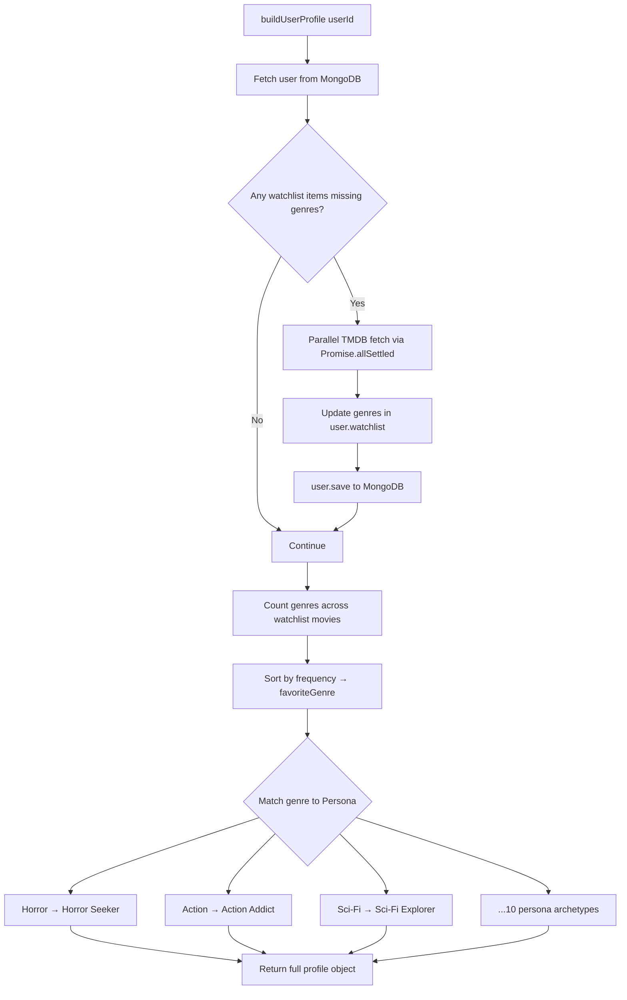

## 📂 Folder Structure

```text
backend/
├── server.js                   # Express app bootstrap & middleware chain
├── package.json
├── .env.example                # Env setup template
├── .env                        # ← NEVER COMMIT (gitignored)
│
├── config/
│   └── tmdb.js                 # Axios TMDB HTTP client (base URL + API key header)
│
├── middleware/
│   └── auth.js                 # JWT verification guard
│
├── models/
│   ├── User.js                 # Core user schema + watchlist subdocument
│   ├── Movie.js                # Cached movie document (15-day TTL)
│   ├── ProviderClick.js        # OTT provider interaction log
│   ├── SearchHistory.js        # Search query history
│   └── BehaviorEvent.js        # XP-weighted behavior events
│
├── routes/
│   ├── achievementRoutes.js    # GET /achievements/overview, /claim
│   ├── analyticsRoutes.js      # GET /analytics/overview, providers, genres
│   ├── authRoutes.js           # POST /register, POST /login
│   ├── behaviorRoutes.js       # POST /behavior/event (XP adjustments)
│   ├── movieRoutes.js          # GET /search, trending, popular, genres, movie details
│   ├── profileRoutes.js        # GET /profile (user info and persona)
│   ├── recommendationRoutes.js # GET /recommend, /recommend/watchlist
│   ├── searchHistoryRoutes.js  # GET & DELETE /history
│   └── watchlistRoutes.js      # GET & POST /watchlist
│
└── services/
    ├── profileEngine.js        # Persona, Movie DNA, XP, self-healing pipeline
    └── tmdbService.js          # Raw metadata retrieval layer
```

---

## 🔒 Middleware Stack

| Middleware | Package | Purpose |
| :--- | :--- | :--- |
| Logger | `morgan` | HTTP request logging |
| Security Headers | `helmet` | XSS, clickjack, MIME protection |
| CORS | `cors` | Cross-origin request control |
| Rate Limiter | `express-rate-limit` | IP-based request throttling |
| Body Parser | `express.json()` | JSON request parsing |
| Sanitizer | `express-mongo-sanitize` | NoSQL injection prevention |
| Auth Guard | `middleware/auth.js` | JWT token verification |

---

## 🛣️ Routes

### Authentication — `authRoutes.js`
| Method | Path | Auth | Description |
| :--- | :--- | :--- | :--- |
| `POST` | `/api/register` | ❌ | Create new user account |
| `POST` | `/api/login` | ❌ | Authenticate & receive JWT |

### Movies — `movieRoutes.js`
| Method | Path | Auth | Description |
| :--- | :--- | :--- | :--- |
| `GET` | `/api/search` | ✅ | TMDB title search |
| `GET` | `/api/trending` | ✅ | Weekly trending titles |
| `GET` | `/api/popular` | ✅ | Popular movies |
| `GET` | `/api/top-rated` | ✅ | Top-rated titles |
| `GET` | `/api/scifi` | ✅ | Science fiction genre |
| `GET` | `/api/horror` | ✅ | Horror genre |
| `GET` | `/api/movie/:id` | ✅ | Full movie details |
| `GET` | `/api/movie/:id/cast` | ✅ | Cast members |
| `GET` | `/api/movie/:id/trailer` | ✅ | YouTube trailer key |
| `GET` | `/api/movie/:id/providers` | ✅ | OTT availability |

### Watchlist — `watchlistRoutes.js`
| Method | Path | Auth | Description |
| :--- | :--- | :--- | :--- |
| `GET` | `/api/watchlist` | ✅ | Fetch user's saved list |
| `POST` | `/api/watchlist` | ✅ | Toggle add/remove + save genres |

### Recommendations — `recommendationRoutes.js`
| Method | Path | Auth | Description |
| :--- | :--- | :--- | :--- |
| `GET` | `/api/recommend` | ✅ | Search-context curation |
| `GET` | `/api/recommend/watchlist` | ✅ | Watchlist-based curation |

### Analytics — `analyticsRoutes.js`
| Method | Path | Auth | Description |
| :--- | :--- | :--- | :--- |
| `GET` | `/api/analytics/overview` | ✅ | Totals: movies, favorite genre/provider |
| `GET` | `/api/analytics/providers` | ✅ | Provider click distribution |
| `GET` | `/api/analytics/genres` | ✅ | Genre affinity map data |

---

## 🗄️ Database Schemas

### `User.js`
```js
{
  username:   String (unique, required),
  password:   String (bcrypt hashed),
  gender:     String (enum: male | female),
  watchlist: [{
    tmdbId:   Number,
    title:    String,
    poster:   String,
    genres:   [String]          // ← Self-healed from TMDB on profile load
  }],
  unlockedAchievements:           [String],
  recommendationViewsCount:       Number,
  openedRecommendationsCount:     Number,
  recommendationInteractionsCount:Number,
  dashboardViewsCount:            Number
}
```

### `ProviderClick.js`
```js
{ userId: ObjectId, provider: String, genre: String, createdAt: Date }
```

### `SearchHistory.js`
```js
{ userId: ObjectId, query: String, searchedAt: Date }
```

### `BehaviorEvent.js`
```js
{ userId: ObjectId, genre: String, weight: Number, createdAt: Date }
```

### `Movie.js`
```js
{ tmdbId: Number, title: String, poster: String, year: String,
  createdAt: Date }   // TTL: 15 days auto-expiry
```

---

## 🤖 profileEngine.js — Core Service

The central intelligence service. Called on every profile/dashboard/watchlist load.



### Persona Archetypes

| Watchlist Top Genre | Assigned Persona |
| :--- | :--- |
| `horror` | Horror Seeker |
| `action` | Action Addict |
| `science fiction` | Sci-Fi Explorer |
| `comedy` | Comedy Lover |
| `drama` | Drama Enthusiast |
| `thriller` | Thriller Hunter |
| `adventure` | Adventure Explorer |
| `fantasy` | Fantasy Dreamer |
| `animation` | Animation Enthusiast |
| `mystery` | Mystery Detective |
| *(fallback)* | Movie Fan |

---

## 🔐 Security Configuration

| Layer | Implementation | Protection |
| :--- | :--- | :--- |
| Passwords | `bcryptjs` (strong adaptive hashing) | Rainbow table attacks |
| Sessions | JWT (signed, configurable expiry) | Stateless auth |
| Headers | `helmet()` | XSS, clickjacking |
| Requests | `express-rate-limit` (IP-based throttling, 700 reqs/15m) | DDoS mitigation |
| DB Queries | `express-mongo-sanitize` | NoSQL query injection |
| Secrets | `.env` (gitignored) | Key exposure |

---

## 📊 Analytics Engine

### Event Sources
```text
User Activity
     │
     ├── OTT Provider Click → ProviderClick collection
     ├── Search Query        → SearchHistory collection
     └── Page Interaction    → BehaviorEvent collection
                                    │
                             profileEngine.js
                                    │
                             ┌──────┴──────┐
                             ▼             ▼
                       Movie DNA      Activity Level
                       (topGenres)    (XP score sum)
```

---

## 🚀 Startup

```bash
npm install
cp .env.example .env   # Fill in credentials
npm start              # node server.js on PORT=5000
```

---

## 🔮 Future Improvements

| Feature | Complexity | Impact |
| :--- | :--- | :--- |
| Redis response caching | Medium | ⬆⬆ API speed |
| Jest unit test suite | Medium | ⬆ Code confidence |
| Docker containerization | Low | ⬆ DevOps portability |
| Vector embedding recommendations | High | ⬆⬆⬆ AI accuracy |
| WebSocket real-time updates | Medium | ⬆ UX richness |
