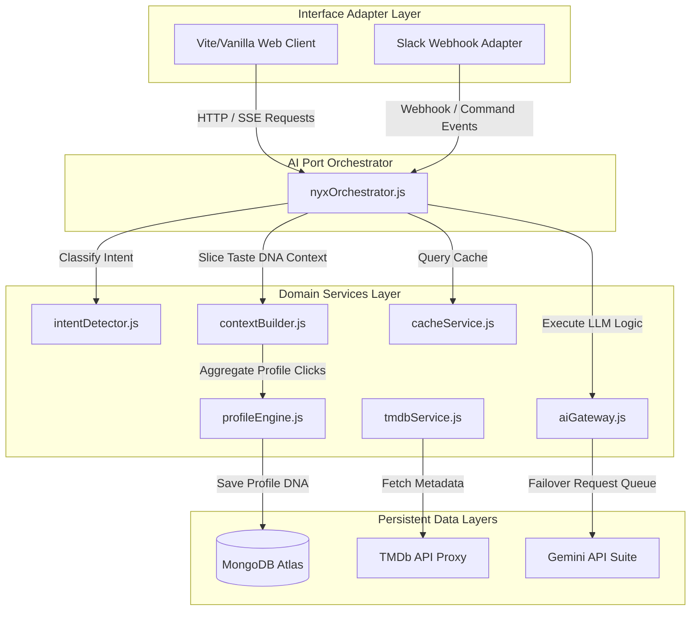
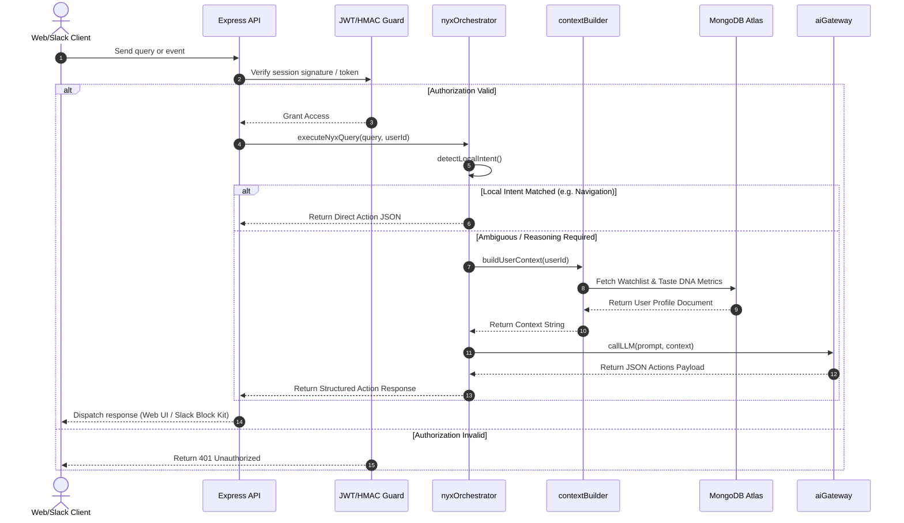

# 🏗️ DARK — Software Architecture

This document details the software architecture, design patterns, folder structure, and request lifecycles of the **DARK AI Movie Intelligence Platform**.

---

## 1. High-Level Architecture (Hexagonal Diagram)

DARK is designed using a decoupled **Hexagonal Ports & Adapters** architecture. Rather than coupling user interfaces (Web browser, Slack, API platforms) with our core taste calculation engines, all clients interact with the core domain via designated port orchestrators.



---

## 2. Directory Layout & Layer Mapping

```text
movie-ai-fullstack/
├── backend/                    # Domain Core & API Gateways
│   ├── config/                 # Service client boots (TMDB client)
│   ├── middleware/             # JWT auth filters & Express security blocks
│   ├── models/                 # MongoDB Mongoose schemas
│   ├── routes/                 # Express API endpoint router files
│   ├── services/AI/            # Core AI OS Layer (The Nyx Brain)
│   └── slack/                  # Slack bolt webhook adapter routes
│
└── frontend/                   # Interface client layouts
    ├── index.html              # Discovery row dashboards
    ├── nyx.js                  # SSE chat widget reader
    └── style.css               # notched safe-area mobile style tokens
```

---

## 3. End-to-End Request Lifecycle

This sequence flowchart shows how incoming requests traverse authentication guards, intent routers, and the central AI port to return structured JSON actions:



---

## 4. Extension & Integration Ports

- **Model Agnostic Adapter:** The interface inside `aiGateway.js` separates prompt construction from model execution. Future models (e.g., Qwen, Llama, Claude) can plug into the rotating list without modifying prompt logic.
- **Client Presentation Adapter:** Additive channels (e.g., Discord or Teams webhooks) can be created by copying the Slack structure: capture incoming webhook events, pass query to `nyxOrchestrator`, and map JSON results to client UI formats.
