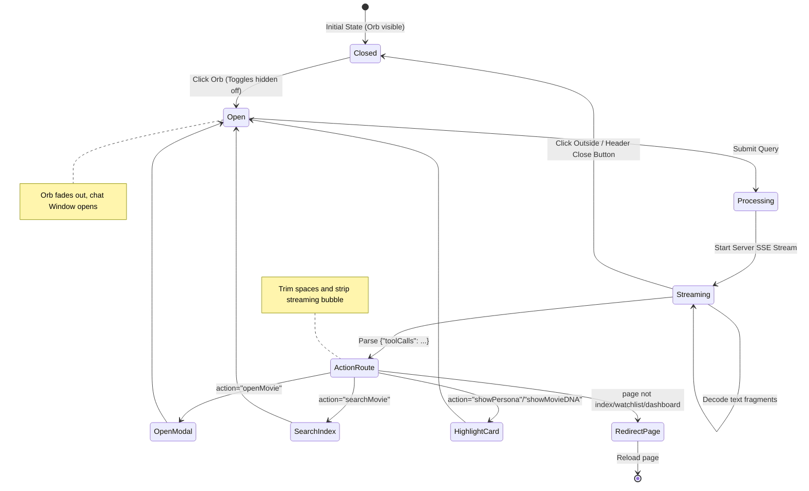

# 🎨 DARK — Frontend Client Architecture

A glassmorphic dashboard interface optimized for mobile and desktop screens. It is built as a single-page discovery application utilizing vanilla ES6 modules.

---

## 1. Directory to UI Component Mapping

| Frontend Resource | Type | UI / UX Role |
| :--- | :--- | :--- |
| **[`index.html`](file:///c:/Users/Anirudh%20thakur/OneDrive/Desktop/movie-ai-fullstack/frontend/index.html)** | Layout | Discovery feed rows, search inputs, and modal portals. |
| **[`dashboard.html`](file:///c:/Users/Anirudh%20thakur/OneDrive/Desktop/movie-ai-fullstack/frontend/dashboard.html)** | Layout | Visual taste profiles, progress bars, and achievement cards. |
| **[`watchlist.html`](file:///c:/Users/Anirudh%20thakur/OneDrive/Desktop/movie-ai-fullstack/frontend/watchlist.html)** | Layout | Curation grid and recommended rows. |
| **[`script.js`](file:///c:/Users/Anirudh%20thakur/OneDrive/Desktop/movie-ai-fullstack/frontend/script.js)** | Controller | Fetching carousel rows, sign-in state, and local search methods. |
| **[`modal.js`](file:///c:/Users/Anirudh%20thakur/OneDrive/Desktop/movie-ai-fullstack/frontend/modal.js)** | Controller | Details drawer, youtube trailer frame, and click trackers. |
| **[`nyx.js`](file:///c:/Users/Anirudh%20thakur/OneDrive/Desktop/movie-ai-fullstack/frontend/nyx.js)** | Client | SSE streaming parser and system command dispatcher. |

---

## 2. Interactive Widget Lifecycle (nyx.js)

This diagram shows how the floating chat widget manages toggle transitions and client-side actions:



---

## 3. Responsive Notch CSS Safe-Areas

To ensure elements are not cut off by hardware notches or navigation bars, the CSS implements safe-area margin offsets:

```css
/* Notch safe-areas and padding clamps */
.nyx-orb-container {
  bottom: clamp(15px, 4vw, 25px);
  right: clamp(15px, 4vw, 25px);
  padding-bottom: env(safe-area-inset-bottom);
}

.nyx-chat-window {
  bottom: clamp(72px, 12vh, 80px);
  max-height: calc(100vh - 100px - env(safe-area-inset-bottom));
}
```
- **Clamp Scaling:** Smoothly scales widget heights and widths across varying mobile and desktop viewport dimensions.
- **Hardware-Accelerated Transitions:** Uses CSS `will-change: transform` and cubic-bezier timings to provide stutter-free animations.
