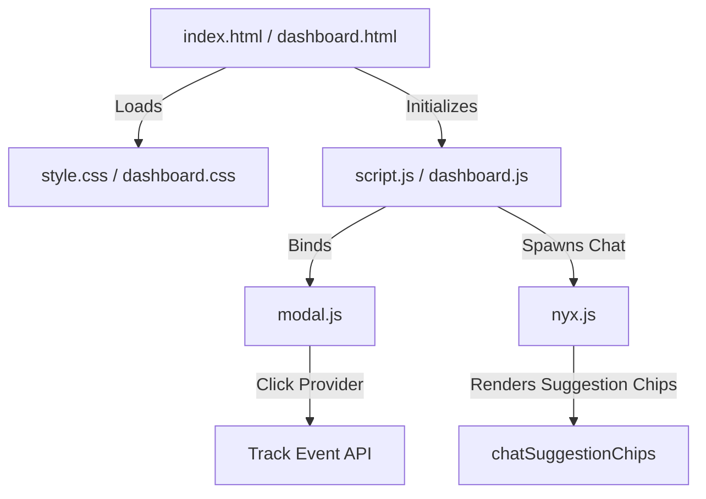

# 🎨 DARK — Frontend Client Architecture & Design System

This directory houses the user-facing web interface for the **DARK AI Movie Platform**. Built as a vanilla ES6 single-page web app, it features a glassmorphic layout, notched device safe-areas, and interactive transitions.

---

## 📌 Table of Contents
1. [Interface Modules & Layouts](#1-interface-modules--layouts)
2. [Component Architecture](#2-component-architecture)
3. [Design Tokens & Safe-Areas](#3-design-tokens--safe-areas)
4. [The Nyx SSE Console Client](#4-the-nyx-sse-console-client)
5. [Performance & Security Guards](#5-performance--security-guards)
6. [Development Standards](#6-development-standards)

---

## 1. Interface Modules & Layouts

The client app is divided into three distinct functional pages:
*   **[`index.html`](./index.html) (Discovery Hub):** Serves weekly trending movie sliders, popularity rows, synopses, YouTube trailer overlays, and local search fields.
*   **[`dashboard.html`](./dashboard.html) (Profile Analytics):** Renders computed genre affinities, streaming provider click percentages, experience progress meters, and unlocked badges.
*   **[`watchlist.html`](./watchlist.html) (Curated Folder):** Lists the user's saved movies and shows automated matching recommendation sliders (e.g. *"Because you watched Dune"*).

---

## 2. Component Architecture



*   **Carousel Carousels:** Built using responsive horizontal scrolls that support debounced mouse-dragging and swipe gestures.
*   **Interactive Modal Drawer:** Manages DOM structures dynamically, creating iframe youtube players and tracking streaming click-through events.
*   **Charts Module:** Uses `Chart.js` to render canvas elements (Genre Distribution Donut, Genre Affinity Bar, and Provider Donut) using custom HSL colors.

---

## 3. Design Tokens & Safe-Areas

To support notch cutouts and home indicator overlays on iOS/Android viewports, the CSS enforces structural boundaries:

```css
/* Notched safe-area spacing standards */
.nyx-orb-container {
  position: fixed;
  bottom: clamp(15px, 4vw, 25px);
  right: clamp(15px, 4vw, 25px);
  padding-bottom: env(safe-area-inset-bottom);
  padding-right: env(safe-area-inset-right);
  z-index: 100000;
}

.nyx-chat-window {
  position: absolute;
  bottom: clamp(72px, 10vh, 80px);
  right: 0;
  max-height: calc(100vh - 120px - env(safe-area-inset-bottom));
}
```
- **Clamp fluid layout:** Ensures that widget layouts dynamically adjust heights and boundaries based on the viewport space.
- **Glassmorphic Panels:** Styled using a combination of backdrop-filters, low-opacity borders, and deep shadows:
  `background: rgba(12, 12, 16, 0.96); backdrop-filter: blur(20px); border: 1px solid rgba(255, 255, 255, 0.08);`

---

## 4. The Nyx SSE Console Client

The chatbot interface [nyx.js](./nyx.js) coordinates streaming interactions and command-execution tasks:
*   **SSE Chunk Reader:** Reads chunks using a standard readable stream reader (`res.body.getReader()`), decodes bytes using `TextDecoder`, and progressively updates the bubble's innerHTML.
*   **Structured Action Router:** Intercepts JSON tool calls (e.g., `{"toolCalls": [{"name": "openMovie", "args": {"movieId": 27205}}]}`). It removes the blank bubble, parses the command, and dispatches the action (such as opening the detail modal or scrolling to a section).
*   **Vercel clean subdirectories support:** Evaluates path prefixes to map `openWatchlist` and `showPersona` actions cleanly on Vercel's clean subdirectories (e.g., `/watchlist` or `/dashboard`).
*   **Orb Transition Handler:** Listens to toggle actions. When the chat drawer window is visible, it triggers a `.chat-open` class on the container to fade out and scale down the red launcher orb, preventing layout overlapping.

---

## 5. Performance & Security Guards

*   **Inactivity Cooldown:** Tracks mouse/touch movements. If no inputs occur for `10 minutes`, the active chat session is cleared from cache and closed.
*   **Client Session Locking:** User authentication tokens are stored inside `sessionStorage`. This isolates the session token exclusively to the active browser tab, blocking cross-tab hijacking.
*   **Local Caches:** The watchlist viewport checks a local sessionStorage cache first, saving network load times on tab navigation.
*   **Input Sanitizer:** Pre-scans chat text inputs against injection signatures and profanity filters before issuing API gateway calls.

---

## 6. Development Standards

1. **Vanilla Modules:** Keep scripts isolated; avoid global declarations that cause conflicts.
2. **Design Compliance:** All components must use CSS design tokens—no ad-hoc utilities.
3. **Clean Code:** Use descriptive semantic class names for all UI sections.
